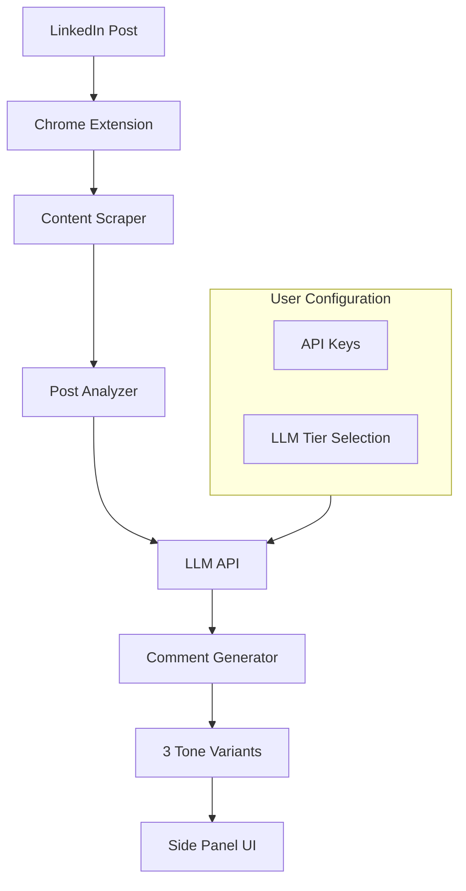
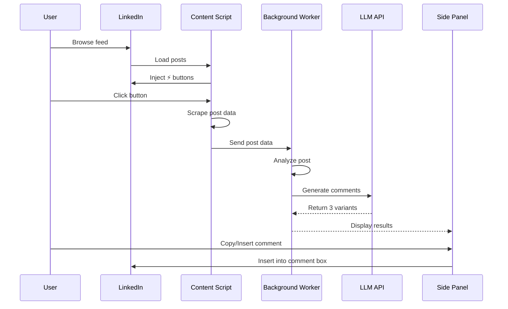

# EngageIQ Implementation Plan

## Product Vision

A Chrome extension that transforms LinkedIn engagement by analyzing posts and generating intelligent, personalized comments with multiple tone variations, powered by AI.

## Core Features (MVP - Phase 1)

### 1. Smart Post Analysis
- Detect post type (thought leadership, announcement, opinion, question, celebration)
- Identify author role from designation (founder, engineer, recruiter, marketer, VC)
- Analyze emotional tone (celebratory, serious, controversial, supportive)
- Detect call-to-action (implicit or explicit)

### 2. Multi-Tone Comment Generation
Generate 3 comment variations for each post:
- **Professional** - Formal, industry-appropriate, clear structure
- **Casual** - Conversational, personal touch, relatable
- **Bold/Opinionated** - Strong stance, slightly controversial, founder-ish energy

### 3. Multi-Tier LLM Support
User-selectable quality tiers:
- **Budget** - GPT-3.5 Turbo (~$0.001/comment)
- **Standard** - GPT-4 Turbo (~$0.01/comment)
- **Premium** - Claude 3 Opus (~$0.015/comment)

### 4. Seamless UX Flow
1. User clicks LinkedIn post → Floating "⚡ EngageIQ" button appears
2. Click button → Side panel opens with post analysis
3. View 3 comment variants with different tones
4. One-click copy or insert into comment box

## Technical Architecture

### Phase 1: Client-Side Extension



### Chrome Extension Structure

```
src/
├── types/
│   └── index.ts              # Centralized type definitions
├── background/
│   ├── service-worker.ts     # Handles API calls, state management
│   └── llm-service.ts        # Multi-provider LLM integration
├── content/
│   ├── scraper.ts            # LinkedIn post data extraction
│   ├── dom-injector.ts       # Floating button injection
│   └── styles.css            # Injection styles
├── sidepanel/
│   ├── index.html
│   ├── app.tsx               # React-based UI
│   ├── components/
│   │   ├── post-summary.tsx  # Post analysis display
│   │   ├── comment-variant.tsx  # Individual comment card
│   │   └── loading-state.tsx    # Loading skeleton
│   └── styles.css            # Tailwind imports
├── popup/
│   ├── index.html
│   ├── settings.tsx          # API keys, tier selection
│   └── styles.css
└── utils/
    ├── post-analyzer.ts      # Post type, tone, role detection
    ├── prompt-builder.ts     # LLM prompt construction
    └── storage.ts            # Chrome storage wrapper
```

**Tech Stack:**
- **TypeScript** - Type-safe development
- **Chrome Extension API** - Manifest V3
- **React 18** - UI components
- **Tailwind CSS** - Utility-first styling
- **Vite** - Build tool & bundler
- **OpenAI API** - GPT-3.5, GPT-4
- **Anthropic API** - Claude Opus
- **Vitest** - Unit testing
- **Playwright** - E2E testing

### Phase 2: Backend & Advanced Features (Post-MVP)

When memory/PDF features are needed:

```
Backend API (Nest.js)
├── Authentication → Clerk
├── Database → PostgreSQL + Prisma
├── User Profiles → Voice preferences, history
├── Memory System → PDF upload & rule extraction
└── Context Storage → Knowledge base from documents
```

**Additional Tech:**
- Nest.js (backend framework)
- PostgreSQL (database)
- Prisma (ORM)
- Clerk (authentication)
- AWS S3 / Cloudflare R2 (PDF storage)

## Implementation Steps

### ✅ Step 1: Chrome Extension Scaffold
- [x] Set up manifest.json (V3)
- [x] Create folder structure
- [x] Configure React + Tailwind
- [x] Add floating button injection
- [x] Create basic UI components

### ✅ Step 2: LinkedIn Content Scraper
- [x] Identify LinkedIn DOM selectors
- [x] Extract post content + author designation
- [x] Handle different post layouts (text, image, article)
- [x] Test across various post types
- [x] Set up unit tests (Vitest)
- [x] Set up E2E tests (Playwright)
- [x] Create test fixtures
- [x] Add CI/CD pipeline

**Technical Details:**
```typescript
// Target LinkedIn DOM selectors
const contentSelectors = [
  '.feed-shared-update-v2__description',
  '.feed-shared-text',
  '.feed-shared-inline-show-more-text'
];

// Author designation extraction
const authorInfo = {
  name: '.feed-shared-actor__name',
  designation: '.feed-shared-actor__description'
};

// Metadata extraction
const metadata = {
  likes: '.social-details-social-counts__reactions-count',
  comments: '.social-details-social-counts__comments',
  shares: '.social-details-social-counts__item--with-social-proof'
};
```

**Data Cleaning:**
- Remove time prefixes ("2h •", "3d •")
- Parse K/M suffixes (2.5K → 2500, 1.2M → 1200000)
- Strip "see more" / "see less" text
- Normalize whitespace

### ⏳ Step 3: Post Analyzer
- [ ] Implement author role detection (from designation)
- [ ] Build post type classifier
- [ ] Add tone detector
- [ ] Create structured analysis output

**Technical Details:**
```typescript
// Author role patterns
const rolePatterns = {
  founder: /founder|co-founder|ceo|entrepreneur/i,
  engineer: /engineer|developer|swe|software/i,
  recruiter: /recruiter|talent|hr|hiring/i,
  marketer: /marketing|growth|content|brand/i,
  vc: /investor|vc|venture|partner/i
};

// Post type detection criteria
- Thought leadership: Long-form (200+ words), insights, lessons
- Announcement: Keywords like "excited", "thrilled", funding, launch
- Opinion: "Unpopular opinion", strong statements, debate triggers
- Question: Explicit questions, polls, "What's your..."
- Celebration: Emojis 🎉, milestones, anniversaries

// Tone detection
- Celebratory: 🎉 emojis, exclamation marks, positive keywords
- Serious: Formal language, no emojis, professional tone
- Controversial: Strong words, debate language, contrarian views
- Supportive: Encouraging words, praise, validation
```

### ⏳ Step 4: LLM Integration
- [ ] Build multi-provider LLM service
- [ ] Implement tier-based routing
- [ ] Create prompt templates for each tone
- [ ] Handle API errors gracefully

**Technical Details:**
```typescript
class LLMService {
  private providers = {
    budget: { provider: 'openai', model: 'gpt-3.5-turbo' },
    standard: { provider: 'openai', model: 'gpt-4-turbo' },
    premium: { provider: 'anthropic', model: 'claude-3-opus' }
  };

  async generateComments(post: LinkedInPost, analysis: PostAnalysis): Promise<CommentVariant[]> {
    const config = this.providers[this.tier];
    
    if (config.provider === 'openai') {
      return this.callOpenAI(post, analysis);
    } else {
      return this.callAnthropic(post, analysis);
    }
  }
}
```

**API Integration:**
- OpenAI: `https://api.openai.com/v1/chat/completions`
- Anthropic: `https://api.anthropic.com/v1/messages`
- Error handling: Retry logic (3 attempts), exponential backoff
- Rate limiting: Track requests per minute
- Caching: Store recent responses to avoid duplicate API calls

### ⏳ Step 5: Comment Generator
- [ ] Generate 3 tone variants
- [ ] Enforce quality rules (no generic phrases)
- [ ] Add length optimization
- [ ] Implement regeneration logic

**Prompt Engineering Strategy:**
```
System: You analyze LinkedIn posts and generate authentic comments.

Context:
- Post Type: {type}
- Author Role: {role}
- Post Tone: {tone}
- Detected CTA: {cta}

Post Content:
{content}

Task: Generate a {tone_variant} comment

Rules:
- Match the post's energy
- Add genuine value, not generic praise
- 2-4 sentences max
- No phrases like "great post!", "thanks for sharing"
- Sound human, not AI
- For Professional: Formal, industry-appropriate
- For Casual: Conversational, personal touch
- For Bold: Strong stance, slightly controversial
```

**Quality Filters:**
- Blacklist generic phrases
- Enforce 2-4 sentence limit
- Check for specific engagement (references post content)
- Validate human-like language patterns

### ⏳ Step 6: Side Panel UI
- [ ] Build React components
- [ ] Add copy/insert functionality
- [ ] Implement loading states
- [ ] Style with Tailwind

**UX Flow:**
1. User clicks LinkedIn post → Floating "⚡ EngageIQ" button appears
2. Click button → Side panel opens with:
   - Post summary (type, tone, author role)
   - Loading state (shimmer animation)
3. Display 3 comment variants with tone labels
4. User actions:
   - Copy to clipboard (one-click)
   - Insert into comment box (auto-fill)
   - Regenerate with different parameters

**UI Components:**
```typescript
<PostSummaryCard analysis={analysis} />
// Shows: Post Type, Author Role, Tone

<CommentVariant 
  comment={text}
  tone="professional"
  onCopy={() => navigator.clipboard.writeText(text)}
  onInsert={() => insertIntoLinkedIn(text)}
/>

<LoadingState />
// Shimmer animation while generating
```

**Design System:**
- LinkedIn brand colors: `#0A66C2` (primary blue)
- Tailwind utility classes for consistency
- Responsive layout (side panel width: 400px)
- Smooth transitions and hover effects

### ⏳ Step 7: Settings & Configuration
- [ ] Create popup for API key management
- [ ] Add tier selection UI
- [ ] Implement Chrome storage
- [ ] Add validation

**Chrome Storage Schema:**
```typescript
interface Settings {
  apiKeys: {
    openai?: string;
    anthropic?: string;
  };
  selectedTier: 'budget' | 'standard' | 'premium';
  preferences: {
    autoInsert: boolean;
    defaultTone: 'professional' | 'casual' | 'bold';
  };
}
```

**Validation:**
- API key format validation (OpenAI: `sk-...`, Anthropic: `sk-ant-...`)
- Test API key on save
- Show connection status indicator
- Encrypted storage for API keys

### ⏳ Step 8: E2E Testing
- [ ] Set up Playwright
- [ ] Write core test scenarios
- [ ] Add CI pipeline (GitHub Actions)
- [ ] Create test fixtures

**Test Scenarios:**

1. **Extension Installation & Setup**
   - Install extension
   - Configure API keys
   - Select LLM tier
   - Verify settings persistence

2. **Post Analysis Flow**
   - Navigate to LinkedIn feed
   - Verify floating button on posts
   - Click button → side panel opens
   - Verify post analysis displays correctly

3. **Comment Generation**
   - Trigger comment generation
   - Verify 3 variants generated
   - Check tone differences
   - Validate character limits

4. **Author Designation Detection**
   - Test with founder post
   - Test with engineer post
   - Test with recruiter post
   - Verify 90%+ accuracy

5. **Copy & Insert Actions**
   - Copy to clipboard → verify
   - Insert into comment box → verify auto-fill
   - Test across different post types

6. **Different Post Types**
   - Announcement posts
   - Question posts
   - Thought leadership
   - Opinion pieces
   - Celebration posts

**Test File Structure:**
```
tests/
├── unit/
│   ├── scraper.test.ts
│   ├── post-analyzer.test.ts
│   ├── prompt-builder.test.ts
│   └── storage.test.ts
├── e2e/
│   ├── scraper.spec.ts
│   ├── extension-integration.spec.ts
│   ├── post-analysis.spec.ts
│   ├── comment-generation.spec.ts
│   └── ui-interactions.spec.ts
├── fixtures/
│   ├── mock-posts.json
│   └── mock-responses.json
└── setup.ts
```

### ⏳ Step 9: Polish & Optimization
- [ ] Add error handling
- [ ] Implement rate limiting
- [ ] Optimize bundle size
- [ ] Add usage analytics (local only)

**Error Handling:**
- Network errors: Retry with exponential backoff
- Invalid API keys: Clear error messages
- LinkedIn DOM changes: Fallback selectors
- Rate limiting: Queue system with user feedback

**Performance Optimization:**
- Code splitting for side panel
- Lazy load components
- Minimize bundle size (target: < 500KB)
- Cache LLM responses (5 min TTL)
- Debounce rapid clicks

**Usage Analytics (Local Only):**
```typescript
interface Analytics {
  commentsGenerated: number;
  copyCount: number;
  insertCount: number;
  regenerateCount: number;
  averageResponseTime: number;
  tierUsage: Record<LLMTier, number>;
}
```

## Advanced Features (Phase 2)

### Memory & Context System
1. **PDF/Document Upload**
   - Users upload books, articles, style guides
   - Extract text via PDF parser
   - LLM summarizes → generates commenting rules

2. **Rule Application**
   - Store rules in PostgreSQL
   - Inject into comment generation prompts
   - Example: "Always acknowledge others' viewpoints first"

3. **Voice Profile**
   - User defines role (Founder, Engineer, Marketer)
   - Set tone preference (Calm, Bold, Witty, Analytical)
   - Emoji usage preference
   - Length preference

4. **Context Memory**
   - Build knowledge base from uploaded content
   - Reference in comments for deeper insights
   - Maintain consistency across comments

## Monetization Strategy

### Free Tier
- Limited comments/day (10-20)
- Basic tone variations
- User brings own API keys
- No personalization memory

### Pro ($10-20/month)
- Unlimited comment generations
- Voice profile & personalization
- Advanced comment modes
- Save favorite styles
- Priority support

### Team/Agency (Future)
- Brand voice presets
- Multiple LinkedIn accounts
- Team collaboration
- Analytics dashboard
- Engagement tracking

## Success Metrics

**MVP Validation:**
- Extension analyzes 5+ post types accurately
- Comment generation < 5 seconds
- 90%+ accuracy on author role detection
- All E2E tests passing
- Comments feel authentic (manual review)

**User Engagement:**
- Daily active users
- Comments generated per user
- Copy vs Insert ratio
- Regeneration rate
- Settings configuration rate

## Risks & Mitigations

| Risk | Mitigation |
|------|-----------|
| LinkedIn DOM changes | Use robust selectors, fallback strategies |
| LLM costs | Client-side caching, user pays with keys |
| Rate limiting | Retry logic, queue system |
| Generic comments | Strong prompt engineering, quality filters |
| Chrome store approval | Follow policies, clear privacy disclosure |

## Timeline Overview

**Week 1-2:** Core extension (Steps 1-4)
**Week 3:** Comment generation & UI (Steps 5-6)
**Week 4:** Settings, testing, polish (Steps 7-9)
**Week 5+:** Phase 2 features (Backend, Memory, Voice Profile)

## Data Flow Diagram



## Chrome Extension Permissions

**Required Permissions:**
- `storage` - Save API keys and preferences
- `activeTab` - Access current LinkedIn tab
- `sidePanel` - Display side panel UI
- `clipboardWrite` - Copy comments to clipboard

**Host Permissions:**
- `https://www.linkedin.com/*` - Inject content scripts

## Next Actions

1. ✅ Complete extension scaffold
2. ✅ Build LinkedIn scraper with tests
3. 🔄 Implement post analyzer with role detection
4. Set up multi-tier LLM integration
5. Create comment generation system

---

**Last Updated:** 2026-02-04
**Current Phase:** Phase 1 - MVP Development  
**Status:** Step 2 Complete, Moving to Step 3  
**Tech Stack:** TypeScript, React, Tailwind, Vite, Vitest, Playwright
